# P5-ADBD - Modelo Relacional: Vistas y Disparadores

## Práctica de Administración y Diseño de Bases de Datos

## Autor

Roberto Padrón Castañeda - alu0101566146@ull.edu.es

---

## 1. Restauración de la Base de Datos

Para restaurar la base de datos `alquilerdvd.tar` (que ahora es `AlquilerPractica.tar`):

## 2. Identificación de Tablas, Vistas y Secuencias

### Tablas principales:

- `film` - Información sobre las películas
- `customer` - Datos de los clientes
- `rental` - Registros de alquileres
- `payment` - Pagos realizados
- `inventory` - Inventario de películas por tienda
- `store` - Información de las tiendas
- `staff` - Empleados
- `actor` - Actores
- `category` - Categorías de películas
- `film_actor` - Relación películas-actores
- `film_category` - Relación películas-categorías
- `address`, `city`, `country` - Información geográfica

### Secuencias:

Las secuencias se usan para generar valores auto-incrementales en las claves primarias de las tablas (SERIAL).

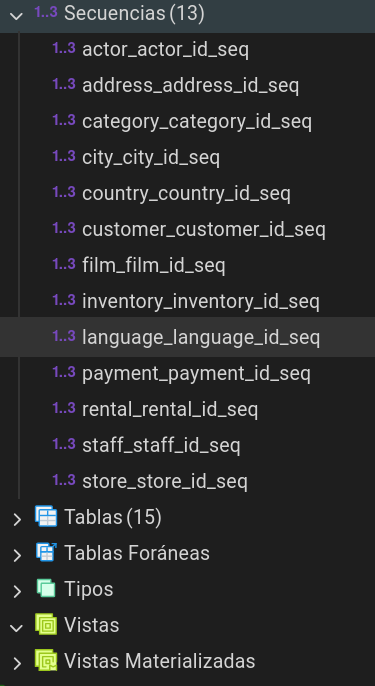

---

## 3. Tablas Principales y sus Elementos

### Modelo de Tablas

El modelo de la base de datos incluye las siguientes relaciones principales:

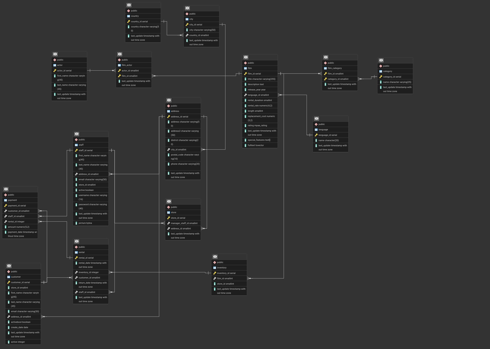

**Tablas principales:**

- **film**: `film_id` (PK), `title`, `description`, `release_year`, `rental_rate`, `length`, `rating`
- **customer**: `customer_id` (PK), `first_name`, `last_name`, `email`, `active`, `store_id` (FK)
- **rental**: `rental_id` (PK), `rental_date`, `inventory_id` (FK), `customer_id` (FK), `return_date`, `staff_id` (FK)
- **payment**: `payment_id` (PK), `customer_id` (FK), `staff_id` (FK), `rental_id` (FK), `amount`, `payment_date`
- **inventory**: `inventory_id` (PK), `film_id` (FK), `store_id` (FK)
- **store**: `store_id` (PK), `manager_staff_id` (FK), `address_id` (FK)

---

### Lista de funciones y desiparadores incluidos

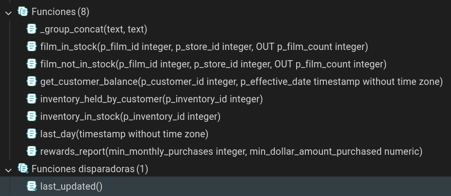

## 4. Consultas Realizadas

### 4.a) Ventas totales por categoría de películas

```sql
SELECT
    c.name AS categoria,
    SUM(p.amount) AS total_ventas
FROM payment p
JOIN rental r ON p.rental_id = r.rental_id
JOIN inventory i ON r.inventory_id = i.inventory_id
JOIN film f ON i.film_id = f.film_id
JOIN film_category fc ON f.film_id = fc.film_id
JOIN category c ON fc.category_id = c.category_id
GROUP BY c.name
ORDER BY total_ventas DESC;
```

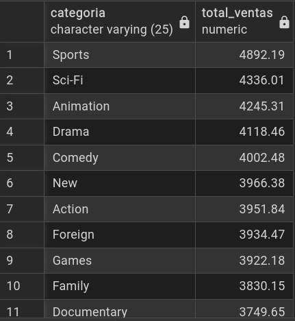

### 4.b) Ventas totales por tienda

```sql
SELECT
    ci.city AS ciudad,
    co.country AS pais,
    st.first_name AS encargado,
    SUM(p.amount) AS total_ventas
FROM payment p
JOIN rental r ON p.rental_id = r.rental_id
JOIN inventory i ON r.inventory_id = i.inventory_id
JOIN store s ON i.store_id = s.store_id
JOIN staff st ON s.manager_staff_id = st.staff_id
JOIN address a ON s.address_id = a.address_id
JOIN city ci ON a.city_id = ci.city_id
JOIN country co ON ci.country_id = co.country_id
GROUP BY ci.city, co.country, st.first_name
ORDER BY total_ventas DESC;
```

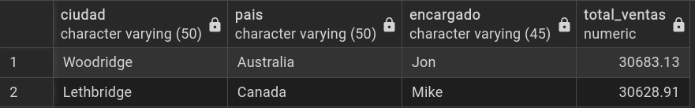

### 4.c) Lista de películas con detalles

```sql
SELECT
    f.film_id,
    f.title,
    f.description,
    c.name AS categoria,
    f.rental_rate AS precio,
    f.length AS duracion,
    f.rating,
    STRING_AGG(CONCAT(a.first_name, ' ', a.last_name), ', ') AS actores
FROM film f
JOIN film_category fc ON f.film_id = fc.film_id
JOIN category c ON fc.category_id = c.category_id
JOIN film_actor fa ON f.film_id = fa.film_id
JOIN actor a ON fa.actor_id = a.actor_id
GROUP BY f.film_id, f.title, f.description, c.name, f.rental_rate, f.length, f.rating
ORDER BY f.title;
```

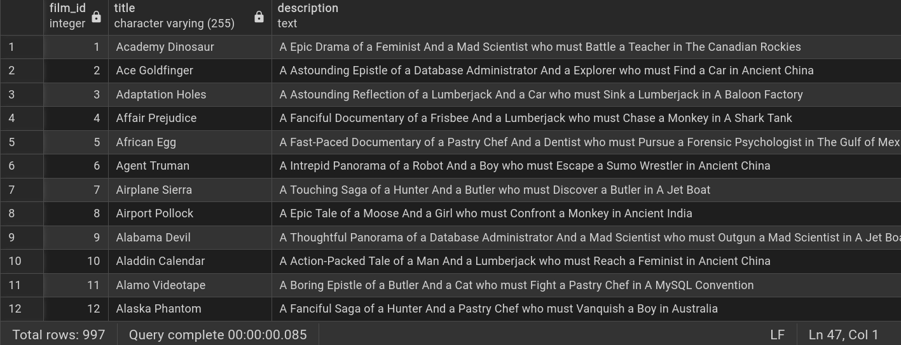

### 4.d) Información de actores con sus categorías y películas

```sql
SELECT
    CONCAT(a.first_name, ' ', a.last_name) AS actor,
    STRING_AGG(DISTINCT c.name || ':' || f.title, ', ') AS categorias_y_peliculas
FROM actor a
JOIN film_actor fa ON a.actor_id = fa.actor_id
JOIN film f ON fa.film_id = f.film_id
JOIN film_category fc ON f.film_id = fc.film_id
JOIN category c ON fc.category_id = c.category_id
GROUP BY actor
ORDER BY actor;
```

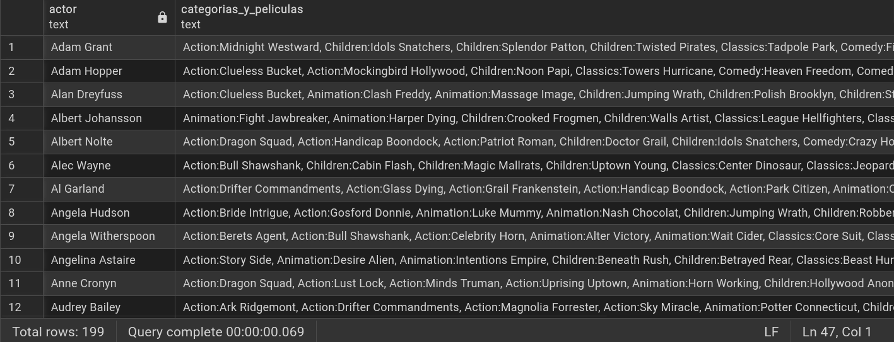

---

## 5. Vistas Creadas

Todas las consultas anteriores se han implementado como vistas con el prefijo `view_`:

```sql
CREATE VIEW view_ventas_categoria AS ...
CREATE VIEW view_ventas_tienda AS ...
CREATE VIEW view_peliculas_detalle AS ...
CREATE VIEW view_actores_peliculas AS ...
```

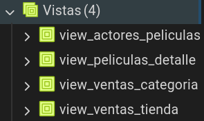

El archivo completo se encuentra en: [Views.sql](Views.sql)

---

## 6. Restricciones CHECK

Después de analizar el modelo, se han incluido las siguientes restricciones CHECK:

```sql
-- Restricciones para la tabla film
ALTER TABLE film
ADD CONSTRAINT chk_film_rental_rate CHECK (rental_rate > 0),
ADD CONSTRAINT chk_film_length CHECK (length > 0),
ADD CONSTRAINT chk_film_rating CHECK (rating IN ('G', 'PG', 'PG-13', 'R', 'NC-17'));

-- Restricciones para la tabla payment
ALTER TABLE payment
ADD CONSTRAINT chk_payment_amount CHECK (amount >= 0);

-- Restricciones para la tabla customer
ALTER TABLE customer
ADD CONSTRAINT chk_customer_active CHECK (active IN (0,1)),
ADD CONSTRAINT chk_customer_email CHECK (email LIKE '%@%');

-- Restricciones para la tabla staff
ALTER TABLE staff
ADD CONSTRAINT chk_staff_email CHECK (email LIKE '%@%');
```

**Justificación:**

- **rental_rate y length**: Deben ser valores positivos
- **rating**: Solo acepta valores válidos de clasificación MPAA
- **amount**: Los pagos no pueden ser negativos
- **active**: Campo booleano (0 o 1)
- **email**: Debe contener el símbolo '@' para ser válido

Ver archivo completo: [Constrains.sql](Constrains.sql)

---

## 7. Trigger last_updated en la tabla customer

### Sentencia del trigger:

```sql
Triggers:
last_updated BEFORE UPDATE ON customer
FOR EACH ROW EXECUTE PROCEDURE last_updated()
```

### Explicación:

Este trigger se ejecuta **ANTES** de cada actualización (UPDATE) en la tabla `customer`. Para cada fila que se actualice, ejecuta la función `last_updated()`, que actualiza automáticamente el campo `last_update` con la fecha y hora actual (`CURRENT_TIMESTAMP`).

### Tablas con solución similar:

Esta misma solución se utiliza en múltiples tablas de la base de datos, por ejemplo:

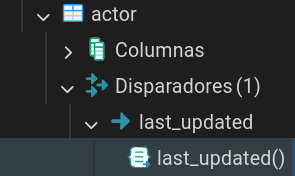
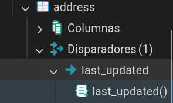

---

## 8. Trigger para Inserciones en la tabla film

### Tablas creadas:

```sql
CREATE TABLE film_inserts (
    id SERIAL PRIMARY KEY,
    film_id INT NOT NULL,
    insert_date TIMESTAMP DEFAULT CURRENT_TIMESTAMP
);
```

### Trigger de inserción:

```sql
CREATE OR REPLACE FUNCTION log_film_insert()
RETURNS TRIGGER AS $$
BEGIN
    INSERT INTO film_inserts (film_id, insert_date)
    VALUES (NEW.film_id, CURRENT_TIMESTAMP);
    RETURN NEW;
END;
$$ LANGUAGE plpgsql;

CREATE TRIGGER trigger_film_insert
AFTER INSERT ON film
FOR EACH ROW
EXECUTE FUNCTION log_film_insert();
```

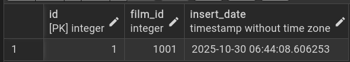

---

## 9. Trigger para Eliminaciones en la tabla film

### Tablas creadas:

```sql
CREATE TABLE film_deletes (
    id SERIAL PRIMARY KEY,
    film_id INT NOT NULL,
    delete_date TIMESTAMP DEFAULT CURRENT_TIMESTAMP
);
```

### Trigger de eliminación:

```sql
CREATE OR REPLACE FUNCTION log_film_delete()
RETURNS TRIGGER AS $$
BEGIN
    INSERT INTO film_deletes (film_id, delete_date)
    VALUES (OLD.film_id, CURRENT_TIMESTAMP);
    RETURN OLD;
END;
$$ LANGUAGE plpgsql;

CREATE TRIGGER trigger_film_delete
AFTER DELETE ON film
FOR EACH ROW
EXECUTE FUNCTION log_film_delete();
```

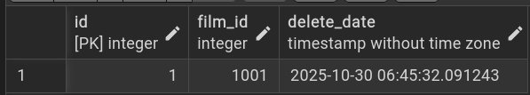

Ver archivos completos: [CreateTables.sql](CreateTables.sql) y [Triggers.sql](Triggers.sql)

---

## Archivos del Proyecto

- `AlquilerPractica.tar` - Base de datos restaurada
- `Views.sql` - Definición de las vistas
- `Constrains.sql` - Restricciones CHECK
- `CreateTables.sql` - Tablas para los triggers
- `Triggers.sql` - Definición de los triggers
- `docker-compose.yml` - Configuración de Docker para PostgreSQL
- `img/` - Capturas de pantalla de las consultas y resultados
